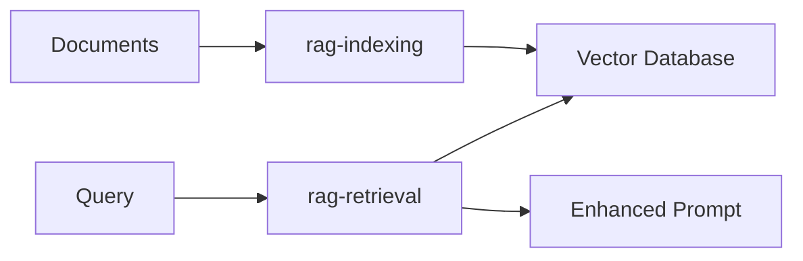

# RAG
> **Retrieval-Augmented Generation** - A comprehensive RAG implementation with multiple application patterns

## Overview

This project contains **2 distinct RAG applications** designed for different use cases:

| Application | Description | Key Features |
|-------------|-------------|--------------|
| **simple-rag** | A streamlined RAG application with optimizations | Query rewriting, document re-ranking |
| **agentic-rag** | An advanced agentic RAG application | Coming soon |

---

## Simple RAG

> A modular RAG system optimized for performance and accuracy

### Architecture Overview

Simple RAG consists of **2 main modules**:



#### **rag-indexing** 
Document processing and vector storage module

##### **rag-indexing-core** 
Shared core functionality for indexing documents

**Features:**
- **Multi-format support** - PDF, DOCX, TXT, and more
- **Text extraction** - Advanced document parsing
- **Embedding generation** - High-quality vector representations
- **Vector storage** - Efficient database integration

##### **rag-indexing-svc**
REST API service for document indexing

**Features:**
- **RESTful API** - Clean HTTP interface
- **Async processing** - Non-blocking operations
- **Core integration** - Leverages rag-indexing-core

**Endpoints:**
```http
POST   /index          # Index documents (async)
GET    /index/{id}     # Check indexing status
```

##### **rag-indexing-job**
Background processing service

**Features:**
- **Background execution** - Non-blocking indexing
- **Core integration** - Uses rag-indexing-core
- **Vector storage** - Persistent embedding storage
- **Result reporting** - Comprehensive status reports

#### **rag-retrieval-svc**
Query processing and retrieval service

**Features:**
- **REST API** - HTTP interface for queries
- **Document retrieval** - Context-aware search
- **Prompt generation** - LLM-ready output

**Endpoints:**
```http
POST   /retrieve       # Get relevant documents + prompt
```

---

## Agentic RAG

TBC

---

## Contributing

TBC

---

## License

TBC
